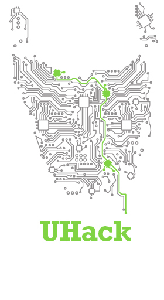
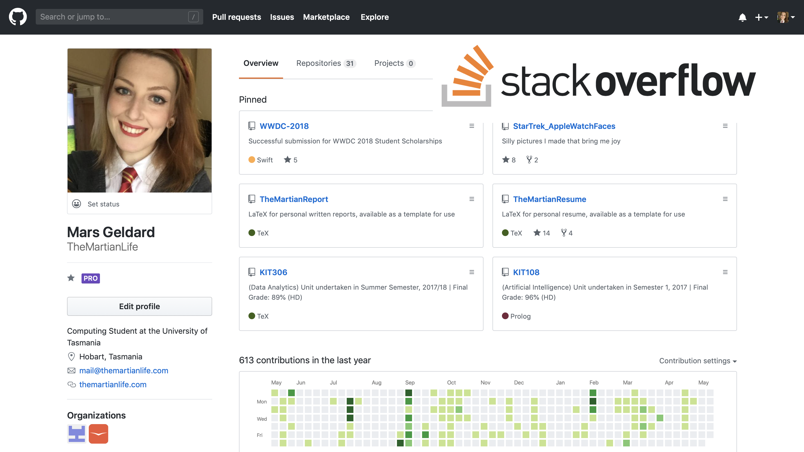

theme: Letters from Sweden, 4
Autoscale: true

# [fit] How to do an
# [fit] ICT degree

^
Hi everyone! I'm here today to present a talk I call "How to do an ICT degree"

---

^
This probably sounds like a weird title, but bear with me.

---

# [fit] Hi, I'm Mars 👋

(Yes, like the planet)

^ 
First of all, I should introduce myself so you know whether you should take anything I say seriously. I'm Mars.

---

# [fit] I did an ICT degree 👩‍💻

^
And as you may be able to tell from my bio, I did an ICT degree.

---

# [fit] 😕😡😢

^
I didn't start out in technology. I actually had a terrible time in high school and thought I would never make it in uni. I was bullied and I had stress in my life outside of school and like many people not having a good time at that age, this made me a very unhappy person. I had no idea what I wanted to do and I didn't think I belonged anywhere. And I thought I would always be that way.

---

# [fit] 🍹🤡🃏
# [fit] 🎰☕️🌙
# [fit] 🥤🍔🍟

^
And after that I worked a bunch of odd jobs I hated in hospitality, gaming, entertainment. Worked mostly at night, ate junk food, never had time for fun or hobbies and got very overweight. Unsurprisingly, my lack of happiness did not improve. 

---

^ 
But at the end of 2015 my family and I moved to Hobart and everyone told me there were no jobs here (they were wrong, but whatever) so I figured I may as well have a go at uni. What was the worst that could happen? I could fail and then go get a job anyway.

---

# [fit] ⚠️ Spoiler Alert!

^
But my whole life changed from there.

---

^
I started out in the University Preparation Program--because I hadn't been in school for a long time and was worried I would need to re-adjust to the format--and the faculty were all so supportive and awesome and invested in everyone doing well. 

^
It was free and fun and it made me a better student, and if I had the choice I would definitely do it again. If you do well in your first semester then you only have to do one, and it means by the time you start your degree you are familiar and confident with how uni works.

---

^ 
Then I finished that and I still didn't really know what I wanted to do but I had classes in the ICT building here and people always looked like they were having fun in the computer labs when I walked past, so I picked that as my degree. I didn't know one thing about programming but I could generally solve the problems my parents had with computers. Seemed like no worse a reason than any other to pick a degree. 

---

[.background-color: #FFFFFF]

^
And it turned out uni wasn't hard, it just took time. And lots of people in my classes were there because their parents told them there was money in computers, or because college made them feel like they _had_ to go to uni, or because they figured it would be the quickest way to be able to pack up and move to Melbourne, so my reason to be there really wasn't that fickle in comparison after all.

---

^
I did some great things over the typical course of my degree: I learned so many things that made me feel smart, I wrote some papers I was really proud of and in my final year I got to work with a company whose product and employees I really admired. I got a perfect GPA and had a really rewarding time. I'm even back doing a second degree now.

---

^
But generally, everyone who has a UTAS ICT degree did these things. Yet not everyone has such a great time or have such great outcomes afterwards. Though this is true, I'm sure, of every degree everywhere.

---

# How to:

### 1. Get the most out of a (UTAS) ICT degree
### 2. Have a great time doing it

^
So this is not so much a "how to do an ICT degree?" because that's very simple: show up and do the work. It's more of a "how to have get the most out of an ICT degree and have a great time doing it".

---

^
Because people on TV told you University was supposed to be the best years of your life! It's supposed to be where you forge lifelong friendships and find new interests and lay around laughing on the lawn with all your new intellectual pals. But that doesn't always just _happen_. So what can you do?

---

# [fit] 1. In your Degree

---

^
Choose your major wisely.

^
There used to be only two Majors to choose from in ICT: Software Development or Games and Creative Technologies. This year they added three more: Business Analysis, Cybersecurity and Data Science. You can orchestrate it so that you don't have to pick for maybe a semester or two and just do the units they have in common, but try to pick something you care about and that interests you, not what someone told you was employable or that you should do.

---

^
Investigate your options for electives. In your degree you'll get up to five empty unit slots for breadth units and electives. There are literally thousands of options to choose from. Most electives are some unit from another degree that you can do if you have mixed interests, and that's great. But there are some really interesting ones. 

---

### Research Electives

^
Every summer they offer research units that let you go and do a whole unit in your own time investigating a topic you pick. There are units for first, second and third year, and for each of these you will get a supervisor from the school, which allows you to make friends with some seriously impressive academics and these look great on your resume.

^
I did all three, with experts and Professors from Games, Human-Computer Interaction, and Cybersecurity, respectively.

---

^
There are also "industry experience" units that will count something you do outside of uni as a unit if you write some assignments about how it benefitted you. This was originally designed for work experience placements and internships but has become so much more.

^
Under this scheme, the Games Research Group takes a bunch of ICT students to exhibit games at PAX in the US each year and see what it's like to be a game developer.

^
Similarly, I spent one Winter on the West Coast of the US at conferences and visiting Sillicon Valley businesses after I got a scholarship to go to a conference and a speaking gig at another. Writing about it was actually fun since I had such a good time, and it took a whole unit off my degree.

---

^
There are also electives focused on community engagement, such as the breadth unit that is part of the Vice Chancellor's Leadership program that credits you for volunteering and outreach activities and, if you complete the program, qualifies you for an award when you graduate.

---

# [fit] Faculty are friends
(Not food)

^
But the best thing you can do within your degree is get to know the faculty staff. They're not like high school teachers who are there to boss you around, they're mentors there to help you succeed. Nobody knows more about what opportunities are out there or what is best for your success than they do and if they know who you are they will bend over backwards to help.

---

# Recap: in your degree

* Pick a major that matters to you
* Investigate your full range of elective options
* Yes, even the weird ones
* Make connections with everyone you can

---

# [fit] 2. At UTAS

---

^
UTAS has a bunch of facilities, but they're sometimes hard to discover. So there's even a "Student Life" page on their website where you can find out about everything on offer. Primarily of interest is the UniGYM and hangout spots on campus, but there's everything from childminding to counselling, every support service you might need for success!

---

^
Linked from that page is also the UTAS events listing, which has everything from meetups to industry networking meetings and expert talks. Almost everything is free but because it's on the website they're sometimes not well advertised anywhere else. So it's definitely worthwhile a look every so often.

---

^
UTAS also has a number of societies, run through the Tasmanian University Union. You can look them up on the TUU website, there are societies for everything from Automobile Appreciation to Beekeeping and every sport you can think of.

---

^
The nerdy ones that are stereotypically popular in ICT are like the eSports society, where you can find people to play games with or against or even join pro teams, the Anime and pop culture societies, or the Tabletop Gaming and Pen-and-Paper role-play societies. 

---

^
There's even HEFT, the society where people dress up in medieval garb and fight each other with real swords. And also ICT has its own society for people into tech, called the TECH society, and there's also DataTas which is a society about Data Science where people meet for cupcakes and debug each other's code. So many options!

---

^
Some groups are more focused on helping other. Like how you can become a student ambassador or join the Ally Network.

---

^
For those looking to buff their resume or takeoff some of the pressure of working through university, UTAS offers a wide array of scholarships and awards that you can browse and apply for through one handy web portal. Some have surprisingly simple criteria, and any you win will go on your transcript and graduation certificate forever.

---

^
In the same vein, there is an invite-only society called the Golden Key that exists around the world that you get invited to if you get a high GPA for one calendar year. You can then become a member forever, no matter your grades after that, and you get access to an enormous network and employment resources and events and all sorts of things.

---

^
And for those that want to see the world, there are a bunch of programs, units and scholarships that let you do parts of your degrees overseas--from a short trip to a semester to a whole degree. Through  programs that reward you for exploring the world and possibly even pay for you to go.

---

# Recap: at UTAS

* Be on the lookout for events
* Take full advantage of UTAS facilities
* Join a society if there's one that interests you
* Check for scholarships and awards
* Go overseas if you want, even while studying!

---

# [fit] 3. In Hobart

---

^
The body associated with this event today, the Australian Computer Society, is an industry body that is headquartered in Sydney and has a branch in each state that works to enrich the tech industry. They work with the government on tech policy, they run campaigns and release publications to inform the public on tech issues and run events and certification schemes to benefit the community. Here in Tasmania, a significant portion of our initiatives focus on improving tech education: running events that benefit students during their studies and aid in their finding employment afterwards.

^
If you're a student, membership fees are very cheap and pay themselves off quickly in free events and online resources.

---

^
We have so many community events in Hobart. Run by too many groups to mention. But a personal favourite of mine are Hackathons. We have two primary ones: the GovHack national hackathon and UTAS's UHack. You sign up and spend a weekend given access to a bunch of data and you have to design and partially implement solutions that are fun and benefit people. It's all catered and it's very fun and many projects are silly or don't go anywhere, but at the end there are huge prizes for feasible ones. They're great for trying things fast, seeing where you fail and building skills. And who knows, you might design something that makes you the big bucks?

---

^
I volunteered for my first one only three weeks into my degree, after seeing a flyer and not knowing what a hackathon was. I had a great time and met a bunch of people who are now my best friends and one who is about to be my husband.

---

^
If that sounds kinda fun but you'd rather make games, we have a thriving community group called the Tasmanian Game Development Society that runs "Game Jams", where people meet and team up to see how much of a game they can make in a weekend. The group also has regular meetups and workshops and includes members ranging from hobbyists to prominent indie developers to people who work on AAA games. This is a bunch of us at a games awards night in Melbourne.

---

^
TasICT is a industry body that supports Tasmanian ICT businesses and every year they have a conference with a large number of events that focus on student networking and employment. Last year this conference became part of a larger statewide event called FutureFest where TasICT and the ACS and a number of industry bodies banded together to offer dozens of tech-focused events over a single week all over the state.

---

^
There are also a bunch of events which as a university student won't be for you, but getting involved is still a great way to learn things and looks super on your resume. Like teaching kids to code with Family Code Club or volunteering at the Enterprize community Hub.

---

# Recap: in Hobart

* Industry bodies exist to help you
* Community events are fun
* Not all societies are associated with the university
* All of these are great ways to meet mentors and make friends, some of who may be the same people
* Paying it forward is super rewarding too!

---

# [fit] 4. In General

---

^
Further abroad are things like Australian conferences that offer scholarships for students or by successful application. Writing a short piece about who you are and how you would benefit from going might win you a free trip to places like Melbourne International Games Week events like PAX and GCAP where you can mingle with real game developers, or developer and data science conferences like YOW!, PyCon, LinuxConf or Devworld. 

^
I went from volunteering at Devworld in 2016 to not helping run it this year and last, and went from getting a scholarship to LinuxConf in 2017 to speaking at a YOW! Conference this month.

^
I've made hundreds of friends, some of whom are shockingly important, been all over the world and learned twice what I would have by just staying here, going to class and doing my degree by itself.

---

^
But what would you be in ICT for if not to broaden your horizons _with_ technology? All the opportunities that exist here can be found elsewhere on the internet. But since you can't go to events and shake hands to become known within an online community, being known online becomes about creating an online presence. Every time you get excited by what you learned in programming class and make something silly in your own time, put it up on the internet and show people.

^
Go to places like GitHub where other people post things they're working on and bits they're like help with, and just have a go at helping. 

^
Or go on Stack Overflow, a website where people post questions about programming problems they're struggling with, and respond to ones you know the answer to.

^
Sites like this are bustling communities of people help each other work on side projects of all sizes, and companies really value these contributions in hiring. It shows you take initiative and can play well with others.

---

# [fit] More other things than 
# [fit] you can imagine!

^
And there are so many more things you can do. Opportunities and being visible and active in the community are things you should do for fun, but they also lead to more opportunities and great benefit.

---

 

^
I had conference scholarships lead to jobs, community meetups lead to other conference scholarships, networking lead to writing a book, online connections leading to featured interviews, more things than I can count.

---

# Recap: in General

* You can go to conferences!
* Not just conferences, lots of things exist with student opportunities!
* You can make things other people can't. Make sure you show them off!
* Just because you are surrounded by people with similar expertise, don't forget you are becoming an expert!

---

^
And one final piece of advice: revel in your successes because not everything you try will be one. This is the corner of my office at home where I put up everything I'm proud of and on days where I have a lot of homework and everything seems really hard, I look up and it keeps me going. 

---

# [fit] Thanks for listening!

---

# [fit] Too fast to take in?
## [fit] Get these slides at
## [fit] github.com / TheMartianLife / BigDayIn2019

